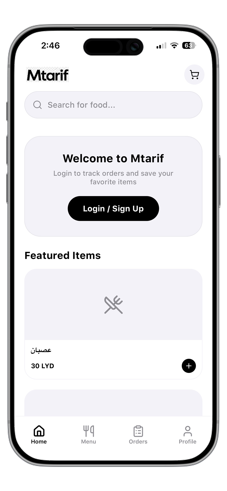

# FoodApp

**Project by Mtarif (Tefooh)**
**Website:** [www.mtarif.com](https://www.mtarif.com)

## Overview

FoodApp is a comprehensive food delivery application solution featuring:
-   **App/Frontend**: React Native (Expo) mobile application for customers.
-   **Admin/Frontend**: React Admin dashboard for managing orders and items.
-   **Admin/Backend**: Express.js backend with Firebase integration.

## ⚠️ Educational Use Only

This project is released strictly for educational purposes. Please **READ THE [LICENSE](LICENSE)** for detailed terms regarding usage, modifications, and commercial restrictions.

## App Screens




## Setup

### Prerequisites
-   Node.js
-   Firebase Account

### Installation

1.  **Clone the repository:**
    ```bash
    git clone https://github.com/tefooh/FoodApp.git
    ```

2.  **Configuration:**
    -   This project requires a Firebase setup.
    -   Context: `.env` files and `firebase.js` configs have been sanitized. You must provide your own Firebase credentials.

3.  **Run App/Frontend:**
    ```bash
    cd App/Frontend
    npm install
    npm start
    ```

4.  **Run Admin/Frontend:**
    ```bash
    cd Admin/Frontend
    npm install
    npm run dev
    ```

5.  **Run Admin/Backend:**
    ```bash
    cd Admin/Backend
    npm install
    npm start
    ```

## Credits

Created by **Mtarif**.
Visit [www.mtarif.com](https://www.mtarif.com) for more information.
